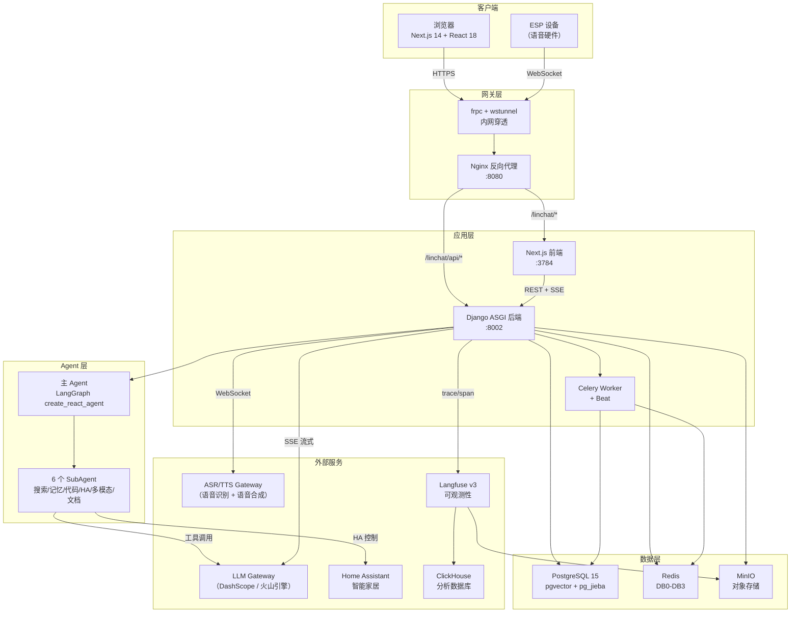
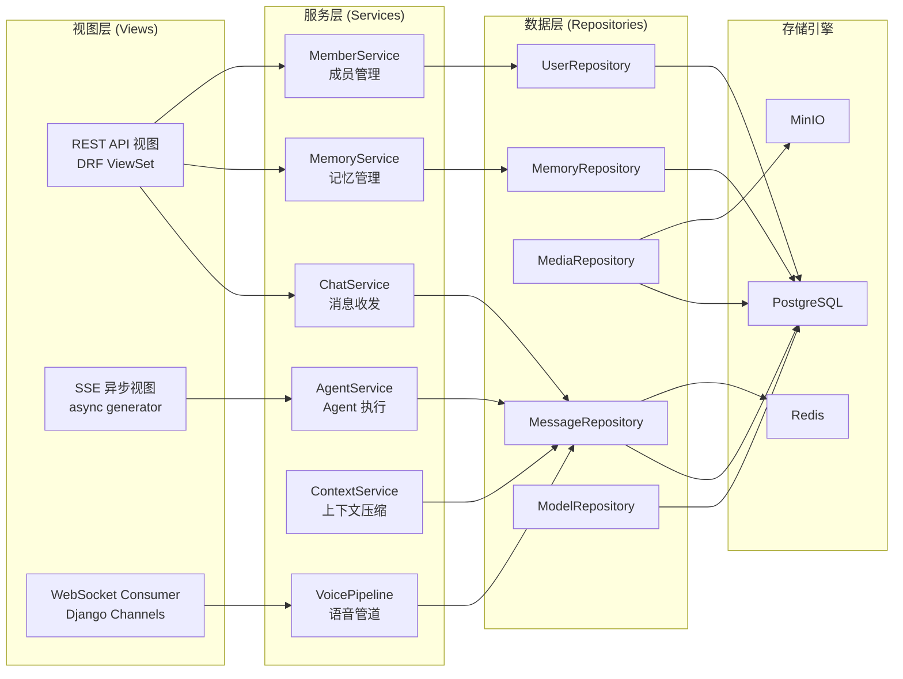
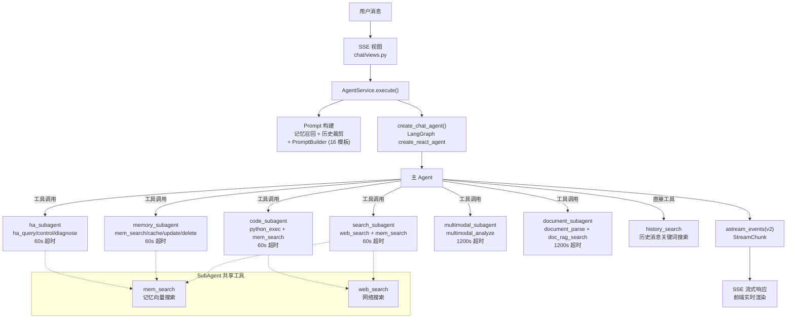
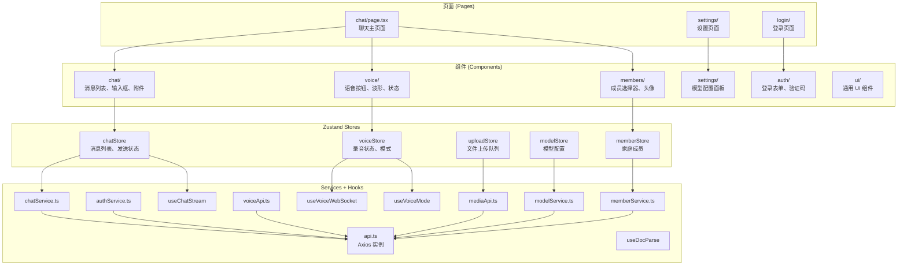
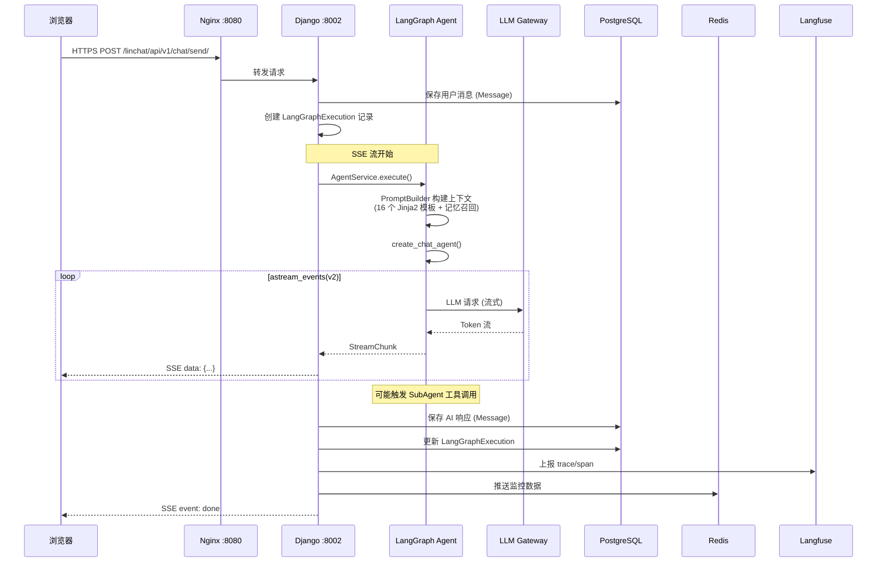
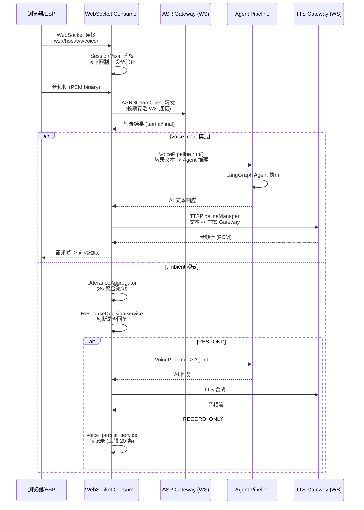
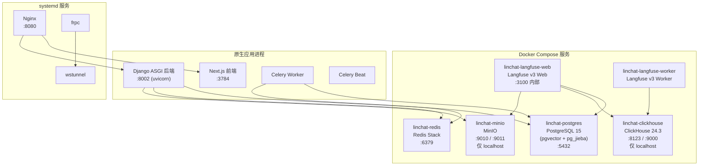

# LinChat 系统架构文档

> 本文档描述 LinChat 大模型聊天平台的完整系统架构，包括分层设计、数据流、基础设施和安全机制。
>
> 相关文档：[API 参考](api-reference.md) | [编码规范](code-standards.md) | [测试指南](testing-guide.md)

---

## 目录

1. [架构总览](#1-架构总览)
2. [分层架构](#2-分层架构)
3. [后端架构](#3-后端架构)
4. [前端架构](#4-前端架构)
5. [数据流](#5-数据流)
6. [基础设施](#6-基础设施)
7. [安全架构](#7-安全架构)
8. [外部集成](#8-外部集成)

---

## 1. 架构总览

LinChat 是一个企业级多租户 AI 聊天平台，采用前后端分离架构，核心能力包括：文本对话（SSE 流式）、语音交互（WebSocket 双向流）、文档解析（RAG 向量检索）、用户记忆（pgvector 向量搜索）、智能家居控制（Home Assistant 集成）。

### 1.1 高层组件图



### 1.2 核心设计原则

| 原则 | 说明 |
|------|------|
| **单用户单会话** | 一个用户永远对应一个会话，Message 只有 `user_id`，无 `conversation_id` |
| **user_id 隔离** | 所有数据查询、并发锁、缓存键按 `user_id` 粒度 |
| **PostgreSQL 为主** | 唯一可信数据来源，ES/Redis 为只读副本/缓存 |
| **写操作原子性** | 事务保护，失败回滚，Celery 异步同步 |
| **ASGI 原生异步** | 禁止 `runserver`，必须 `uvicorn`，支持 SSE + WebSocket |

---

## 2. 分层架构

LinChat 后端严格遵循三层架构，禁止跨层调用。

### 2.1 三层架构图



### 2.2 各层职责

| 层级 | 文件 | 职责 | 禁止事项 |
|------|------|------|----------|
| **视图层** | `views.py` | HTTP 请求/响应处理、参数校验、权限检查 | 禁止编写业务逻辑 |
| **服务层** | `services.py` 或 `services/` | 封装所有业务逻辑、事务管理、外部调用编排 | 禁止直接操作 ORM |
| **数据层** | `repositories.py` | 封装 ORM/Redis/MinIO 操作、查询构建 | 禁止包含业务判断 |

### 2.3 通信协议

| 协议 | 用途 | 实现方式 |
|------|------|----------|
| **REST** | CRUD 操作（消息、记忆、模型配置、成员管理） | DRF ViewSet + Serializer |
| **SSE** | 聊天流式响应、文档解析进度推送 | ASGI async generator + `apps.common.sse` |
| **WebSocket** | 语音双向流（PCM 音频帧 + 控制指令） | Django Channels + Redis DB3 |

---

## 3. 后端架构

### 3.1 Django Apps 总览

后端包含 10 个 Django App，按职能划分：

| App | 关键模型 | 职责 |
|-----|----------|------|
| **chat** | `Message`, `LangGraphExecution` | 消息收发、SSE 流式响应、推理取消 |
| **common** | 无 | 中间件、异常体系、响应格式、SSE 工具、Gateway 调用、Rate Limiter、MinIO 封装 |
| **context** | 无 | Prompt 构建（16 个 Jinja2 模板）、上下文裁剪（Trimmer）、Token 预算管理 |
| **graph** | 无 | LangGraph Agent 工厂/执行、6 个 SubAgent、工具链、推理取消、GPU 锁 |
| **media** | `MediaAttachment`, `DocumentChunkEmbedding` | 媒体上传/下载、文档解析（Gateway）、RAG 向量分块（1024 维 pgvector） |
| **memory** | `UserMemory`, `UserMemoryEmbedding` | 用户记忆 CRUD、pgvector 向量搜索（混合搜索 0.7 向量 + 0.3 关键词）、Embedding、定时总结 |
| **models** | `ModelConfig` | LLM 模型配置（tool/multimodal/embedding）、SM4 加密密钥 |
| **users** | `SysUser` | 验证码登录、Token 鉴权（httpOnly Cookie）、SSO 冲突、SM3/SM4、成员管理 |
| **voice** | `SpeakerProfile`, `RegisteredDevice`, `VoiceSettings` | WebSocket 语音流、ASR/TTS Gateway 客户端、声纹、设备管理、ambient 监听 |
| **agent** | 无 | Agent Prompt 模板存储 |

### 3.2 LangGraph Agent 管道

LinChat 的 AI 能力基于 LangGraph `create_react_agent` 构建，主 Agent 通过工具调用分派任务给 6 个 SubAgent。



### 3.3 Agent 工厂

`agent.py` 提供四种 Agent 工厂：`create_chat_agent()`（主聊天，SubAgent 工具，无 checkpointer）、`create_context_agent()`（上下文管理，Redis checkpointer）、`create_memory_agent()`（记忆管理）、`create_cronmem_agent()`（定时总结，无工具）。

关键机制：`get_llm()` 从 `ModelConfig` 表读取配置创建 `ChatOpenAI`；`get_thread_id()` 返回 `user_{user_id}` 确保隔离；`_wrap_prompt()` 动态裁剪历史避免超 token；`stream_multimodal_httpx()` 绕过 LangChain 直连 Gateway 处理 `video_url`/`audio_url` 扩展类型。

### 3.4 SubAgent 架构

每个 SubAgent 通过 `run_subagent()` 工厂函数创建，内部是独立的 `create_react_agent`：

```
run_subagent(task, config, tools, prompt, llm, name, timeout, recursion_limit)
  -> 获取 LLM -> 合并工具 -> create_react_agent -> 超时控制 -> 异常处理
```

SubAgent 对主 Agent 而言是一个黑盒工具（`@tool` 装饰器），主 Agent 只看到工具名称和描述。

SubAgent 工具清单：

| SubAgent | 专属工具 | 共享工具 | 超时 |
|----------|----------|----------|------|
| search_subagent | `web_search` | `mem_search` | 60s |
| memory_subagent | `mem_cache`, `mem_update`, `mem_delete` | `mem_search`, `web_search` | 60s |
| code_subagent | `python_exec` | `mem_search`, `web_search` | 60s |
| ha_subagent | `ha_query`, `ha_control`, `ha_diagnose` | `mem_search`, `web_search` | 60s |
| multimodal_subagent | `multimodal_analyze` | `mem_search`, `web_search` | 1200s |
| document_subagent | `document_parse`, `doc_rag_search` | `mem_search` | 1200s |

### 3.5 graph/services/ 包结构

`agent_service.py`（Agent 执行入口）、`helpers/prompt.py`（Prompt 构建 + 记忆召回）、`helpers/errors.py`（Token 提取 + 错误检测）、`helpers/finalize.py`（消息收尾）、`helpers/monitor.py`（Langfuse trace + 监控推送）、`context_service.py`（上下文压缩）、`inference_service.py`（推理任务管理）、`cancel_monitor.py`（取消信号监控）、`gpu_lock.py`（GPU 互斥锁）。

### 3.6 Celery 异步任务

| 任务名称 | 所属模块 | 触发方式 | 说明 |
|----------|----------|----------|------|
| `memory.generate_embedding` | memory | 事件驱动 | 单条记忆的 Embedding 生成 |
| `memory.retry_failed_embeddings` | memory | 定时 (Beat) | 重试失败的 Embedding |
| `memory.generate_daily_summary` | memory | 定时 (Beat) | 每日记忆总结 |
| `memory.generate_monthly_summary` | memory | 定时 (Beat) | 每月记忆总结 |
| `memory.embedding_health_check` | memory | 定时 (Beat) | Embedding 健康检查 |
| `media.clean_expired_media` | media | 定时 (Beat) | 过期媒体文件清理 |
| `media.generate_document_embeddings` | media | 事件驱动 | 文档向量分块生成 |
| `media.retry_failed_doc_embeddings` | media | 定时 (Beat) | 重试失败的文档 Embedding |
| `users.expire_guests` | users | 定时 (Beat) | 过期访客账户清理 |

Celery Broker 使用 Redis DB2，所有定时任务通过 Celery Beat 调度。

### 3.7 语音管道架构

VoiceConsumer 采用 3 Mixin 架构：`SessionMixin`（会话/鉴权/频率限制）、`EventMixin`（消息路由）、`InferenceMixin`（ASR -> Agent -> TTS 管道）。链路：`浏览器/ESP -> WebSocket -> VoiceConsumer -> ASRStreamClient -> Gateway ASR -> 转录 -> VoicePipeline -> Agent -> TTSPipelineManager -> Gateway TTS -> 音频流 -> 前端`。Ambient 模式额外引入 `UtteranceAggregator`（3s 聚合）和 `ResponseDecisionService`（RESPOND / RECORD_ONLY / STOP 决策）。

---

## 4. 前端架构

### 4.1 页面结构

| 路由 | 页面 | 说明 |
|------|------|------|
| `/` | `page.tsx` | 首页（重定向到聊天） |
| `/chat` | `chat/page.tsx` | 聊天主页面 |
| `/settings` | `settings/` | 设置页面（模型配置、语音设置） |
| `/login` | `login/` | 登录页面（验证码 + SM4 加密） |
| `/401` | `401/` | 未授权提示页 |

### 4.2 前端架构图



### 4.3 Zustand Store 职责

| Store | 核心状态 | 说明 |
|-------|----------|------|
| **chatStore** | 消息列表、发送/接收状态、取消标志 | 聊天核心状态，管理 SSE 流式接收 |
| **voiceStore** | 录音状态、语音模式（voice_chat / ambient）、音频队列 | 语音交互状态 |
| **uploadStore** | 上传队列、进度、已上传文件列表 | 文件上传管理 |
| **modelStore** | 模型配置列表、当前激活模型 | 模型选择与配置 |
| **memberStore** | 家庭成员列表、当前选中成员 | 多用户成员切换 |

### 4.4 自定义 Hooks

| Hook | 说明 |
|------|------|
| `useChatStream` | SSE 流式接收，基于 `fetch` API 的 `ReadableStream` |
| `useVoiceWebSocket` | WebSocket 连接管理，PCM 音频帧发送/接收 |
| `useVoiceMode` | 语音模式切换（voice_chat / ambient） |
| `usePCMAudioCapture` | 浏览器麦克风 PCM 音频采集（AudioWorklet） |
| `useAudioRecorder` | 音频录制（用于声纹注册等场景） |
| `useDocParse` | 文档解析进度追踪（SSE 进度推送） |
| `useVoiceErrorHandler` | 语音交互错误统一处理 |
| `useAuth` | 认证状态管理（登录/登出/Token 刷新） |

### 4.5 通信与样式

通信：REST（Axios `api.ts`）、SSE（`fetch` + `ReadableStream`）、WebSocket（原生 API，语音 PCM 帧）。样式：Tailwind CSS + 自定义 `ui/` 组件。部署：`npm run build` 后 `npm run start`，禁止 `npm run dev`。

---

## 5. 数据流

### 5.1 文本聊天流

这是 LinChat 最核心的数据流，从用户输入到 AI 流式响应的完整链路。



### 5.2 语音交互流



### 5.3 记忆数据流

`Message 保存 -> Celery generate_embedding -> Embedding API -> 1024 维向量 -> UserMemoryEmbedding (pgvector)`。查询时使用混合搜索：`0.7 x 向量余弦相似度 + 0.3 x 关键词匹配`。Celery Beat 定时调度每日/每月总结（`cronmem_agent` 生成结构化记忆事实）。

### 5.4 文档解析与 RAG 数据流

`上传文件 -> MediaAttachment + MinIO -> document_subagent -> document_parse 工具 -> Gateway POST /v1/documents/parse -> 轮询 tasks/ -> Markdown 结果 -> 文本分块 (1024 字符) -> Embedding (1024 维) -> DocumentChunkEmbedding (pgvector)`。后续对话通过 `doc_rag_search` 工具向量检索相关文档片段注入 Agent 上下文。

---

## 6. 基础设施

### 6.1 Docker 服务架构



### 6.2 Redis 数据库分配

| DB | 用途 | 关键 Key 模式 |
|----|------|---------------|
| **DB0** | Django 缓存 + 会话 + Token 信息 | `token:{uuid}`, `rate_limit:*`, `captcha:*` |
| **DB1** | Langfuse 缓存 | 由 Langfuse 内部管理 |
| **DB2** | Celery Broker + Beat 调度 | `celery-task-*` |
| **DB3** | Django Channels Layer | WebSocket 路由, TTSRouter groups |

此外还存在自定义 Key 用于语音/推理状态：`voice:session:*`, `inference:*`, `doc_parse:*`, `gpu_lock:*`

### 6.3 PostgreSQL 扩展

| 扩展 | 用途 |
|------|------|
| **pgvector** | 1024 维向量存储 + 余弦相似度搜索（记忆向量 + 文档 RAG 向量） |
| **pg_jieba** | 中文全文检索分词支持 |

数据库承载两个 schema：`linchat`（应用数据）和 `langfuse`（监控数据），共用同一个 PostgreSQL 实例。

PostgreSQL 使用自定义 Docker 镜像（`docker/postgres/Dockerfile`），预装 pgvector 和 pg_jieba 扩展。

### 6.4 网络拓扑

公网访问链路（抗 DPI 设计）：

```
公网 HTTPS 请求
    |
    v
frp 服务端 (infra.greydan.xin)
    | wss://infra.greydan.xin:443 (WebSocket over TLS, 抗 DPI)
    v
wstunnel client (127.0.0.1:7443)
    | TCP
    v
frpc (连接 127.0.0.1:7443)
    |
    v
Nginx (:8080)
    |-- /linchat/api/* -> Django 后端 (:8002)
    |-- /linchat/ws/*  -> Channels WebSocket
    |-- /linchat/*     -> Next.js 前端 (:3784)
    +-- /*             -> DeepTutor (其他项目)

Nginx (:8081)
    +-- /*             -> Langfuse Web (:3100)
```

公网地址：

| 服务 | 地址 |
|------|------|
| LinChat | `https://www.greydan.xin/linchat` |
| LinChat API | `https://www.greydan.xin/linchat/api/v1` |
| Langfuse | `http://www.greydan.xin:8081` |

### 6.5 服务管理

所有 LinChat 应用服务通过 `scripts/services.sh` 统一管理：

```bash
./scripts/services.sh start     # 启动所有应用服务
./scripts/services.sh stop      # 停止（通过 .pids/ PID 文件追踪）
./scripts/services.sh restart   # 重启
./scripts/services.sh status    # 查看状态
```

**禁止**手动 `nohup` 启动应用进程，会导致孤儿进程积累。

服务管理分类：

| 服务类别 | 管理方式 |
|----------|----------|
| Docker 服务 (PG/Redis/ClickHouse/MinIO/Langfuse) | `docker compose up -d` |
| systemd 服务 (Nginx/frpc/wstunnel) | `systemctl start/stop/restart` |
| 应用服务 (Django/Celery/Next.js) | `scripts/services.sh` |

### 6.6 端口速查表

| 端口 | 服务 | 绑定地址 |
|------|------|----------|
| 3784 | Next.js 前端 | 0.0.0.0 |
| 8002 | Django ASGI 后端 (uvicorn) | 0.0.0.0 |
| 8080 | Nginx 反向代理（主入口） | 0.0.0.0 |
| 8081 | Nginx -> Langfuse | 0.0.0.0 |
| 5432 | PostgreSQL | 0.0.0.0 |
| 6379 | Redis | 0.0.0.0 |
| 8123 / 9000 | ClickHouse (HTTP / Native) | 127.0.0.1 |
| 9010 / 9011 | MinIO (S3 / Console) | 127.0.0.1 |
| 3100 | Langfuse Web | 127.0.0.1 |

---

## 7. 安全架构

### 7.1 认证与鉴权

| 层面 | 机制 | 说明 |
|------|------|------|
| **登录认证** | 验证码 + 密码 | 图形验证码防暴力破解 |
| **Token 存储** | httpOnly Cookie | **禁止** localStorage，防 XSS 攻击 |
| **Token 中间件** | `common/middleware.py` | 每次请求从 Cookie 提取 Token，从 Redis DB0 查询用户信息 |
| **SSO 冲突** | 单设备登录 | 新登录踢掉旧会话 |
| **账户锁定** | 连续 5 次失败锁定 15 分钟 | 防暴力猜测 |
| **WebSocket 鉴权** | `websocket_auth.py` | WS 连接建立时验证 Token |
| **多用户支持** | `_resolve_target_user()` | 中间件支持 member_type 解析目标用户 |

### 7.2 加密体系

| 算法 | 用途 | 库 | 说明 |
|------|------|-----|------|
| **国密 SM3** | 密码哈希 | `gmssl` | 不可逆，替代 bcrypt |
| **国密 SM4** | API 密钥加密存储 | `gmssl` | 对称加密，数据库中的 LLM API Key 全部加密 |
| **SM4 前端** | 登录密码传输加密 | `sm-crypto` (JS) | 前端加密后传输，后端解密验证 |

### 7.3 频率限制

| 场景 | 限制 | 实现 |
|------|------|------|
| 匿名 API | 100 次/小时 | `common/rate_limiter.py` + Redis 计数器 |
| 认证 API | 1000 次/小时 | Redis 计数器 |
| LLM 调用 | 60 次/分钟 | Redis 滑动窗口 |
| WebSocket 连接 | 频率限制 | `voice_session_service.check_ws_rate_limit()` |
| WebSocket LLM | 频率限制 | `voice_session_service.check_llm_rate_limit()` |

### 7.4 数据隔离

| 维度 | 策略 |
|------|------|
| **查询隔离** | Repository 层所有查询必须包含 `user_id` 条件，跨用户访问返回 404 |
| **缓存键隔离** | Redis Key 包含 `user_id` 前缀 |
| **并发锁隔离** | GPU 锁、推理任务按 `user_id` 粒度 |
| **Thread ID** | LangGraph checkpointer 使用 `user_{user_id}`，不同用户不共享状态 |

### 7.5 敏感信息保护

- `.env` 文件不入版本控制（`.gitignore`）
- API Key 数据库中使用 SM4 加密存储，运行时解密
- 日志中脱敏处理，不打印完整 Token/Key
- 禁止提交任何敏感信息到 Git 仓库

---

## 8. 外部集成

### 8.1 LLM Gateway

LinChat 通过统一的 Gateway 接口调用大模型，当前使用 DashScope Coding Plan。

| 配置项 | 说明 |
|--------|------|
| API Base | `https://coding.dashscope.aliyuncs.com/v1` |
| 当前模型 | `kimi-k2.5`（综合性能最优：86-96 tok/s，首 token ~1s） |
| 存储方式 | `ModelConfig` 表，支持 tool / multimodal / embedding 三种类型 |
| 加密 | API Key 使用 SM4 加密存储 |

模型能力矩阵：

| 模型类型 | 用途 | 调用方式 |
|----------|------|----------|
| **tool** | 主 Agent + SubAgent 推理 | `ChatOpenAI` (LangChain SDK) |
| **multimodal** | 图片/视频/音频理解 | `httpx` 直连（绕过 LangChain，因不支持扩展类型） |
| **embedding** | 记忆/文档向量化 (1024 维) | `OpenAIEmbeddings` (LangChain SDK) |

### 8.2 Langfuse 可观测性

Langfuse v3 提供 LLM 调用的全链路追踪：

| 组件 | 说明 |
|------|------|
| **Langfuse Web** | 监控面板（:3100 内部，:8081 Nginx 代理公网） |
| **Langfuse Worker** | 异步数据处理 |
| **ClickHouse** | 分析数据库（trace/span 聚合） |
| **MinIO** | 大对象存储（长文本输入/输出） |

集成：`LangfuseCallbackHandler` 自动追踪 Agent 执行；`helpers/monitor.py` 上报 trace/span；`gateway_utils.py` 使用 `start_span()` (3.x API)；客户端为模块级单例，不同步 flush。

### 8.3 ASR/TTS Gateway

语音 Gateway 通过 frpc STCP 隧道连接（`llm-gateway-visitor`，`127.0.0.1:8100`）。ASR（WebSocket 流式识别，长连接，心跳 30s/60s）、TTS（WebSocket 流式合成）、声纹注册（HTTP）、VAD（嵌入 ASR）。ASR/TTS 客户端共用 `BaseWSClient` 基类（连接管理 + 心跳 + 接收循环）。

### 8.4 Home Assistant 智能家居

`ha_subagent` 通过 `ha_client.py` 调用 Home Assistant REST API（`http://172.17.0.1:8124`，Docker 内网），提供 `ha_query`（设备状态查询）、`ha_control`（设备控制）、`ha_diagnose`（故障诊断）三个工具。Node-RED (端口 1880) 提供额外自动化规则。

### 8.5 集成拓扑总览

| 外部服务 | 连接方式 | 协议 | 用途 |
|----------|----------|------|------|
| DashScope LLM | HTTPS 公网 | REST (SSE) | 文本推理（OpenAI 兼容接口） |
| ASR Gateway | frpc STCP | WebSocket | 流式语音识别 |
| TTS Gateway | frpc STCP | WebSocket | 流式语音合成 |
| Home Assistant | Docker 内网 | REST | 智能家居控制 |
| Langfuse | localhost | REST | LLM 可观测性追踪 |
| MinIO | localhost | S3 | 对象存储（媒体文件 + 文档） |
| ClickHouse | localhost | HTTP / Native | Langfuse 分析数据 |
| Node-RED | Docker 内网 | HTTP / WS | 智能家居自动化规则 |

---

## 附录

### A. 数据模型概览

| 模型 | App | 关键字段 |
|------|-----|----------|
| `SysUser` | users | username, password_hash (SM3), member_type, is_active |
| `Message` | chat | user_id, role, content, status, token_count |
| `LangGraphExecution` | chat | user_id, request_id, status, tokens_used |
| `MediaAttachment` | media | user_id, message_id, file_type, minio_key |
| `DocumentChunkEmbedding` | media | attachment_id, chunk_index, embedding (1024d) |
| `UserMemory` | memory | user_id, content, memory_type, source |
| `UserMemoryEmbedding` | memory | memory_id, embedding (1024d) |
| `ModelConfig` | models | name, type (tool/multimodal/embedding), api_key (SM4) |
| `SpeakerProfile` | voice | user_id, speaker_id, quality_score |
| `RegisteredDevice` | voice | user_id, device_id, device_type |
| `VoiceSettings` | voice | user_id, tts_voice, asr_language |

### B. 技术栈速查

| 层级 | 技术选型 |
|------|----------|
| 后端框架 | Django 4.2+ / DRF 3.14+ / uvicorn 0.30+ |
| AI Agent | LangGraph 0.2+ / LangChain 0.2+ / Langfuse 3.12+ |
| 前端框架 | Next.js 14 / React 18 / TypeScript 5.0+ / Tailwind CSS |
| 状态管理 | Zustand |
| 主数据库 | PostgreSQL 15 + pgvector + pg_jieba |
| 缓存 | Redis (django-redis) |
| 对象存储 | MinIO (S3 兼容) |
| 任务队列 | Celery 5.3+ (Redis DB2 Broker) |
| WebSocket | Django Channels 4.0+ (Redis DB3) |
| 国密算法 | gmssl (SM3 + SM4) |

### C. 相关文档

| 文档 | 路径 | 说明 |
|------|------|------|
| 项目宪法 | [.specify/memory/constitution.md](../.specify/memory/constitution.md) | 不可违背的原则和约束 |
| 代码示例 | [constitution-examples.md](constitution-examples.md) | 编码时强制参考 |
| Gateway 集成指南 | [linchat-integration-guide.md](linchat-integration-guide.md) | Gateway 接口文档 |
| 上游集成指南 | [upstream-integration-guide.md](upstream-integration-guide.md) | LLM Gateway 对接 v2.0 |
| 多模态 API | [multimodal-api-guide.md](multimodal-api-guide.md) | 多模态文档解析 API |
| TTS WebSocket | [tts-websocket-api.md](tts-websocket-api.md) | TTS 流式 API |

---

*最后更新：2026-03-31*
