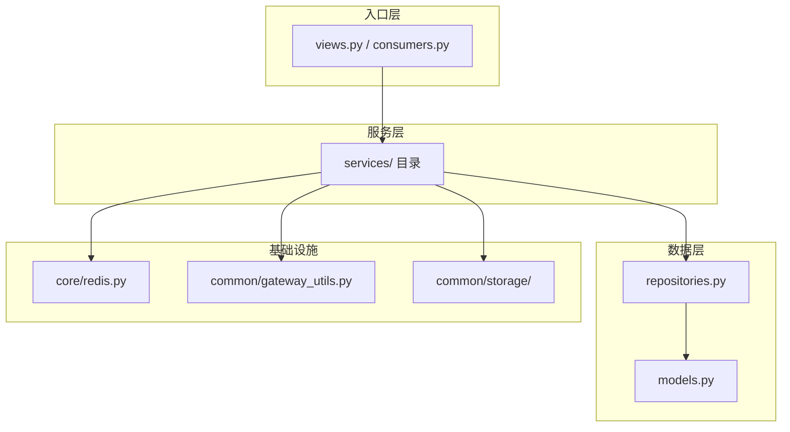
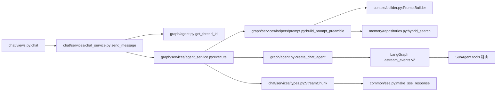
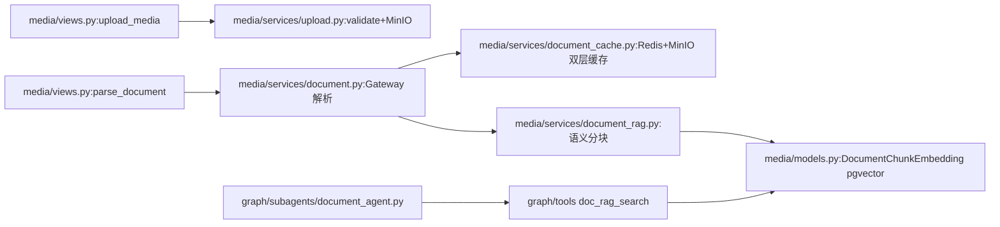

# LinChat 架构分析（Phase 1）

> 生成时间：2026-04-16
> 数据范围：backend/ (Python, ~13k LOC, 10 apps)
> 先验输入：docs/legacy-and-debts.md (reviewed by 安琳)
> 分析方法：静态代码扫描 + git 历史 + 依赖图推导

## 执行摘要

- 后端 app 数量：**10**（chat, common, context, graph, media, memory, models, users, voice, agent）
- 识别分层违规：**11 处**（services 层直接 ORM 9 处 + views 层 Redis 直操作 2 处）
- 循环依赖：**6 组**（chat<->graph 最严重，16 个跨边文件）
- 上帝模块：**common**（被 45 文件依赖）、**graph**（被 31 文件依赖）
- 技术债 Top 3：`core/settings.py`(513L/25commits)、`voice/consumer_session.py`(255L/8commits)、`graph/services/agent_service.py`(246L/11commits)
- Open Questions：**8 个**

---

## 1. 实际分层结构



### 宪法要求 vs 实际情况

| 层级 | 宪法要求 | 实际 | 合规 |
|------|---------|------|------|
| views → services | 仅处理 HTTP 请求响应，禁止业务逻辑 | ✓ chat/views.py 无 ORM 调用，委托 ChatService | 合规 |
| services → repositories | 封装业务逻辑 | ⚠ voice/services 9 处直接 `Message.objects.*` | 部分违规 |
| repositories → ORM | 封装数据操作 | ✓ chat/media/memory/models/users/voice 均有 repo | 合规 |
| graph 无 repository | — | ✓ graph 无模型，通过 chat.repositories 访问 | 架构合理 |
| context 无 repository | — | ✓ context 是纯计算模块，无持久化 | 架构合理 |
| common 无 repository | — | ✓ common 是基础设施层 | 架构合理 |

### ✓ 确认：6 个有模型的 app 均实现了 repository 层

chat, media, memory, models, users, voice — 均有 `repositories.py`。

### ⚠ views 层存在 Redis 直操作

`chat/views.py:35-48`：chat 视图函数内直接调用 `get_redis()` 做多模态限流（Redis NX）。虽然逻辑简单，但违反了"views 层不含业务逻辑"原则。应下沉到 ChatService 或 rate_limiter。

---

## 2. 模块依赖图

```mermaid
graph LR
    chat <-->|16 files| graph
    chat -->|6| common
    common <-->|7| users
    graph -->|4| memory
    graph -->|4| context
    voice -->|21| graph
    voice -->|20| chat
    voice -->|18| users
    voice -->|15| common
    media -->|11| common
    memory <-->|2| users
    memory <-->|2| graph

    classDef god fill:#f96,stroke:#333
    class common,graph god
```

### 被依赖排名（fan-in，被 N 个文件导入）

| App | 被依赖文件数 | 角色 |
|-----|-------------|------|
| **common** | **45** | ✓ 上帝 app — 基础设施层，合理 |
| **graph** | **31** | ⚠ 上帝 app — Agent 核心，但承担了过多编排职责 |
| media | 24 | 媒体/文档 |
| voice | 21 | 语音（多为内部引用） |
| chat | 20 | 消息核心 |
| users | 18 | 认证/成员 |
| memory | 15 | 记忆 |
| context | 14 | Prompt 构建 |
| models | 11 | 模型配置 |

### 扇出排名（fan-out，自己导入 N 个其他 app）

| App | 依赖 app 数 | 说明 |
|-----|------------|------|
| **voice** | **7**（chat, common, graph, media, memory, models, users） | ⚠ 最高扇出 — 语音是最复杂的集成层 |
| **graph** | **5**（chat, common, context, memory, users） | Agent 编排层 |

### ✓ 循环依赖分析（6 组）

| 组 | 方向 A→B / B→A | 严重度 | 说明 |
|----|---------------|--------|------|
| **chat <-> graph** | 4 / 7 文件 | **高** | graph 依赖 chat.models/repositories（Message/Execution），chat 依赖 graph.services（AgentService）。核心纠缠。 |
| chat <-> common | 6 / 1 文件 | 低 | common→chat 仅 1 处，可能为测试或兼容 |
| common <-> users | 2 / 5 文件 | 低 | 认证中间件天然耦合 |
| graph <-> memory | 4 / 1 文件 | 低 | memory→graph 仅 `CRONMEM_PROMPT_TEMPLATE` 导入 |
| memory <-> users | 1 / 1 文件 | 低 | 用户记忆天然关联 |
| users <-> voice | 2 / 1 文件 | 低 | 声纹/设备认证 |

**chat<->graph 是最严重的循环依赖**。`AgentService`（graph）重度依赖 `Message`/`MediaAttachment`/`ExecutionRepo`/`StreamChunk`/`generation`（chat），而 `ChatService`（chat）反向依赖 `AgentService`（graph）。这说明 **graph 实际承担了"消息生命周期管理"职责**，与 chat 的边界模糊。

---

## 3. 分层违规

### 3.1 Services 层直接 ORM（绕过 Repository）— 9 处

| 文件:行 | ORM 调用 | 影响 |
|---------|---------|------|
| `voice/services/voice_pipeline.py:142` | `Message.objects.filter(...).update` | 更新 ambient 用户消息 |
| `voice/services/voice_persist_service.py:82` | `Message.objects.filter(...).first()` | 查找用户消息 |
| `voice/services/voice_persist_service.py:86` | `MediaAttachment.objects.create(...)` | 创建附件 |
| `voice/services/voice_persist_service.py:92` | `Message.objects.filter(...).first()` | 查找助手消息 |
| `voice/services/voice_persist_service.py:129` | `Message.objects.filter(...).values()` | 查询已回复消息 |
| `voice/services/voice_persist_service.py:130` | `Message.objects.filter(...)` | record_only 查询 |
| `voice/services/voice_persist_service.py:139` | `Message.objects.filter(...).delete()` | 清理旧消息 |
| `voice/services/speaker_service.py:131` | `Message.objects.filter(...).update()` | 回溯更新 speaker_id |
| `media/services/document_rag.py:142` | `MediaAttachment.objects.filter(...)` | 文档 RAG 查询 |

**模式**：voice 服务层 7 处直接操作 chat 模块的 `Message.objects`，绕过了 `message_repo`。这是 voice 模块 7 轮迭代累积的技术债。

### 3.2 Views 层含业务逻辑 — 2 处

| 文件:行 | 违规 | 说明 |
|---------|------|------|
| `chat/views.py:35-48` | Redis NX 限流 | 多模态限流逻辑直接写在 view 中，应下沉到 service |
| `chat/views.py:65-72` | `async_to_sync` + 分页逻辑 | 分页判断 `len(messages) > limit` 在 view 中，勉强可接受 |

### 3.3 Services 层无 HTTP 对象反向穿透

✓ 经扫描确认，services 层未发现返回 `JsonResponse`/`HttpResponse` 的情况。

---

## 4. 核心业务链路

### 4.1 SSE 流式聊天



**参与模型**：Message, LangGraphExecution, MediaAttachment, UserMemory, UserMemoryEmbedding, ModelConfig

**关键分支点**：
- `agent_service.py:67`：`is_multimodal` 分支（含 GPU 锁、1500s 超时、cancel_monitor）
- `agent.py:create_chat_agent`：SubAgent 工具集动态注册
- `agent_service.py:105-147`：`astream_events` 循环中 `parent_ids` 深度过滤（>3 跳过 SubAgent 内部输出）

### 4.2 语音全双工

```mermaid
flowchart LR
    A[consumers.py:VoiceConsumer] --> B[consumer_session.py:ASR 连接]
    B --> C[asr_stream_client.py → Gateway ASR WS]
    C --> D[consumer_events.py:transcription.completed]
    D -->|voice_chat| E[consumer_inference.py:_start_voice_pipeline]
    D -->|ambient| F[utterance_aggregator.py:add → 3s 聚合]
    F --> G[response_decision_service.py:decide 8 级决策]
    G -->|RESPOND| E
    G -->|RECORD_ONLY| H[voice_persist_service.py:record_only_ambient]
    E --> I[voice_pipeline.py:run_pipeline]
    I --> J[graph/services/agent_service.py:execute]
    J --> K[tts_pipeline_manager.py → tts_stream_client.py → Gateway TTS WS]
    K --> L[tts_router.py:group_send → 浏览器/HA 音箱]
```



**参与模型**：Message, SpeakerProfile, VoiceSettings, RegisteredDevice, ModelConfig

**关键分支点**：
- `consumer_events.py:55-58`：`voice_chat` vs `ambient` 模式分流
- `response_decision_service.py`：8 级决策链（唤醒词 → LLM 意图 → active_conv → 默认 RECORD_ONLY）
- `voice_pipeline.py:48-56`：barge-in 打断检测（lock.locked → cancel → 2s 等待超时跳过）
- `voice_pipeline.py:155-166`：TTS 输出路由（browser vs HA speaker，含 xiaomi_miot 降级链）

### 4.3 文档 RAG



**参与模型**：MediaAttachment, DocumentChunkEmbedding, UserMemory（记忆上下文增强）

**关键分支点**：
- `document.py`：Gateway 轮询（3s 间隔，最大 900s）+ SSE 进度通知
- `document_rag.py`：pgvector 1024 维向量 + pg_jieba 全文检索混合搜索

---

## 5. 状态管理

| 状态 | 权威位置 | 副本/缓存 | 同步机制 | 风险 |
|------|---------|----------|---------|------|
| 用户认证 Token | Redis DB0 (`auth:token:{hash}`) | httpOnly Cookie | 同步写 | ✓ 无风险 |
| 消息历史 | PostgreSQL (Message) | 无 Redis 缓存 | 直接 ORM | ✓ 单一写入源 |
| 记忆 Embedding | PostgreSQL pgvector | 无 | Celery 异步生成 | ✓ 失败重试机制 |
| 语音会话状态 | Redis DB0 (`voice:session:{uid}`) | 无 | 每次操作直写 | ⚠ 无持久化备份 |
| 语音音频缓存 | Redis DB0 (`voice:audio_chunks:{uid}:{seg}`) | MinIO (持久化后) | pipeline 完成后迁移 | ⚠ Redis 重启丢失未持久化音频 |
| 推理任务锁 | Redis DB0 (`user:{uid}:inference_task`) | 无 | NX + TTL 300s | ✓ TTL 兜底 |
| GPU 互斥锁 | Redis DB0 (`multimodal:gpu_lock`) | 无 | NX + 30s 心跳 | ✓ TTL 兜底 |
| 活跃对话标记 | Redis DB0 (`voice:active_conv:{uid}`) | 无 | TTL 10s 自动过期 | ✓ 无持久化需求 |
| 文档解析缓存 | Redis DB0 + MinIO | 无 | 双层缓存 | ✓ 缓存穿透安全 |
| Celery 任务 | Redis DB2 (Broker) | 无 | Celery 标准 | ✓ 标准组件 |
| WebSocket 通道 | Redis DB3 (Channels) | 无 | Channels 标准 | ✓ 标准组件 |

### ⚠ Redis 连接管理问题

**`core/redis.py:64-74`**：`RedisClient.get_client()` **每次调用创建新连接**（`aioredis.from_url()`），无连接池。经统计，voice 模块 9 个文件共 ~10 处 `get_redis()` 调用，graph 模块 ~8 处。高并发语音场景下可能造成连接风暴。

注释说明"避免事件循环问题"，但在 ASGI 模式下（单一事件循环），连接池是安全且推荐的做法。

### ⚠ 多处写入同一状态

- `Message` 写入分散在 3 个模块：`chat/repositories`（正常路径）、`voice/services/voice_persist_service`（7 处直接 ORM）、`voice/services/voice_pipeline`（1 处直接 ORM）。共 8 处绕过 `message_repo`。

---

## 6. 技术债热力图

评分公式：行数>300(+2)、行数>500(+3)、commits>15(+2)、commits>20(+3)、覆盖率<50%(+2)、覆盖率<70%(+1)、安琳"没人敢动"(+3)、循环依赖核心(+2)

| 排名 | 文件 | 行数 | 近6月commits | 覆盖率 | 评分 | 建议 |
|------|------|------|-------------|--------|------|------|
| 1 | `core/settings.py` | 513 | 25 | N/A | **8** | P2 域拆分（安琳已批准） |
| 2 | `voice/consumer_session.py` | 255 | 8 | ~54%* | **8** | P2 Mixin 整理（安琳已批准） |
| 3 | `graph/services/agent_service.py` | 246 | 11 | ~80% | **7** | P2 execute() 拆分 |
| 4 | `voice/services/response_decision_service.py` | 229 | 9 | 99% | **4** | 测试优秀，可维护 |
| 5 | `voice/consumers.py` | 162 | 10 | ~54%* | **7** | P2 Mixin 架构整理 |
| 6 | `voice/consumer_events.py` | 175 | ? | ~54%* | **7** | 同上（3 Mixin 共担覆盖率） |
| 7 | `voice/services/voice_pipeline.py` | 190 | 10 | 97% | **4** | 测试优秀 |
| 8 | `voice/services/voice_persist_service.py` | 143 | ? | 66% | **4** | P3 覆盖率补齐 + ORM 下沉 |
| 9 | `media/services/document.py` | 216 | ? | ? | **3** | 兼容委托清理 |
| 10 | `users/views.py` | 222 | ? | 50% | **4** | P3 覆盖率补齐 |
| 11 | `graph/agent.py` | 141 | 11 | ? | **4** | 工厂函数，改动频繁但结构清晰 |
| 12 | `core/redis.py` | 200 | ? | ? | **3** | 连接池改造 |
| 13 | `consumer_inference.py` | 68 | ? | 54% | **4** | P3 覆盖率补齐（安琳已批准） |
| 14 | `common/event_service.py` | 154 | ? | ? | **2** | 结构清晰 |
| 15 | `chat/views.py` | 117 | 10 | ? | **3** | Redis 限流下沉 |

*注：consumer_inference.py 覆盖率 54% 来自 legacy-and-debts.md，3 Mixin 共享同一个 consumer 测试覆盖。

### except Exception 分布（143 处总计）

| 模块 | 数量 | 说明 |
|------|------|------|
| graph | 44 | 最多 — Agent 编排中大量兜底 |
| voice | 35 | Mixin + services |
| media | 24 | 文档解析/缓存 |
| common | 15 | 中间件/网关 |
| memory | 13 | 总结/embedding |
| users | 10 | 认证/成员 |
| chat | 1 | 极少 |
| models | 1 | 极少 |
| context | 0 | 无 |

### 兼容 shim 清理优先级

| Shim 文件 | 活跃调用者 | 清理优先级 |
|-----------|----------|-----------|
| `graph/prompts.py` | 5（3 个生产 + 2 个测试） | **高 — 最多调用者** |
| `chat/tasks.py` | 1（测试文件） | 中 |
| `context/tokenizer.py` | 1（context/__init__.py） | 中 |
| 其余 9 个 shim | 0 | **低 — 可直接删除** |

---

## 7. Open Questions

1. **Q1**：`core/redis.py` 每次 `get_redis()` 创建新连接是否有测量过连接数峰值？ASGI 下连接池是否可安全使用？— *Pending Decision*
2. **Q2**：`chat <-> graph` 循环依赖的解法：将 `Message`/`Execution` 模型和 `StreamChunk`/`generation` 工具提取为独立 app（如 `core_models`），还是接受当前状态？— *Pending Decision*
3. **Q3**：voice 模块 3-Mixin 整理的目标形态是什么？保持 Mixin 但加接口约束（Protocol）？还是改为组合（composition）？— *Pending Decision*
4. **Q4**：`graph/prompts.py` shim 有 5 个活跃调用者（含 `memory/services.py` 的 `CRONMEM_PROMPT_TEMPLATE`），清理时 memory→context 的新导入路径是否会引入新的循环依赖？— 需验证
5. **Q5**：`voice/services/voice_persist_service.py` 7 处直接 ORM 是否应该统一经由 `chat.repositories.message_repo`？还是 voice 应有自己的 message repository 封装？— *Pending Decision*
6. **Q6**：`except Exception` 143 处中，哪些是有意的兜底（如 disconnect cleanup），哪些是开发期遗留？graph 44 处是否可安全缩减？— 需分类审计
7. **Q7**：`agents/` app（仅含 `prompts/fallback_router.j2`）与 `context/templates/` 的 23 个模板是否应合并？当前模板分散在两个位置。— *Pending Decision*
8. **Q8**：声纹识别 bug（legacy-and-debts.md 二-B）的根因是 `SpeakerProfile` 样本库只有一条记录（H1），还是 `speaker_service` 匹配逻辑缺陷（H2）？— Phase 1 fix batch 需定位

---

*下一步：交给 call-chain-profiler 做性能分析（重点：端到端语音 5s SLO），交给 refactor-planner 汇总为分批次重构方案。*
