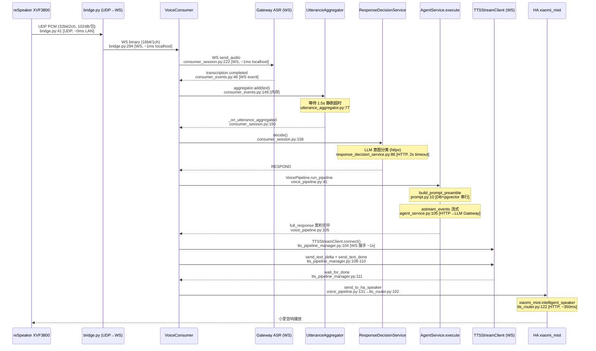

# LinChat 调用链路性能分析（Phase 1）

> 生成时间：2026-04-16
> 先验输入：legacy-and-debts.md（含安琳主观锚点）、02-issue-diagnosis.md
> 方法：静态分析（未做压测）

## 执行摘要

- 分析链路数：4 条
- 锚点与降级说明：
  - SSE 链路：降级（宪法要求首 token < 2s，但无实测端到端基准）
  - 浏览器语音链路：降级（无量化基准）
  - **端到端语音链路（小爱）：有 SLO 基准 5s**，深度分析，日志实测 P50=10.8s
  - 文档 RAG：降级（无量化基准）
- 4 条链路瓶颈总数：**14**
- 跨链路通用优化点：**4**（Redis 无连接池、PromptBuilder 串行、LLM 意图分类 39% 超时、Trace ID 缺失）
- **达到 5s SLO 所需优化点：轻量 ambient prompt 绕过完整 Agent（-4~5s）、TTS 连接复用（-1s）、流式 TTS chunk 合成（-1~2s）**
- Top 3 快速收益：(1) ambient 轻量 prompt 替代完整 Agent、(2) TTS WS 连接复用/预连接、(3) Redis 连接池

## 1. SSE 流式聊天链路

### 1.1 调用链

```
chat view (views.py:25)
  → ChatService.send_message (chat_service.py:30)
    → AgentService.execute (agent_service.py:33) [async generator]
      → sync_to_async(model_service.get_active_model) (prompt.py:17) — 同步 DB 查询
      → MemoryService.search_memory (prompt.py:28) — pgvector 混合搜索
      → message_repo.find_latest_by_user (prompt.py:50) — DB 查询历史
      → PromptBuilder.build_preamble_with_breakdown (prompt.py:77) — CPU 拼装
      → ContextService.check_token_limit (agent_service.py:93) — CPU token 计数
      → create_chat_agent (agent_service.py:101) — LLM 工厂
      → agent.astream_events (agent_service.py:105) — LangGraph 流式
        → on_chat_model_stream → yield StreamChunk → SSE
      → finalize_completion (agent_service.py:160) — DB 持久化
  → make_sse_response (sse.py:43) → StreamingHttpResponse
```

### 1.2 瓶颈

| # | 瓶颈 | 位置 | 定性判断 | 建议 |
|---|------|------|---------|------|
| 1 | `build_prompt_preamble` 三步串行 | `prompt.py:17-81` | model_service(DB) → MemoryService.search_memory(pgvector) → message_repo(DB) 三个 IO 操作串行执行，各约 10-50ms | 可用 `asyncio.gather` 并行化，预估节省 ~20-50ms，待压测 |
| 2 | `sync_to_async(model_service.get_active_model)` | `prompt.py:17` | 同步 ORM 走 `sync_to_async` 线程池桥接，每次 pipeline 调用一次 | 可加 TTL 缓存（模型配置低频变更），避免每次 DB 查询 |
| 3 | `ContextService.check_token_limit` + 压缩 | `agent_service.py:93-96` | token 计数是 CPU 密集（tiktoken），压缩路径含 LLM 调用 | 压缩极少触发，token 计数 ~5-10ms，低优先级 |

## 2. 浏览器语音全双工链路

### 2.1 调用链

```
前端 useVoiceMode (WebSocket)
  → VoiceConsumer.receive (consumers.py:107)
    → _handle_audio_frame (consumer_session.py:219)
      → asr_client.send_audio (asr_stream_client.py:30) — WS 转发 PCM
      → voice_session_service.cache_audio_chunk — Redis RPUSH
    → _handle_asr_event (consumer_events.py:13)
      → _on_transcription_completed (consumer_events.py:46)
        → _start_voice_pipeline (consumer_inference.py:12)
          → VoicePipeline.run_pipeline (voice_pipeline.py:41)
            → _setup_tts — TTSPipelineManager 创建 + comfort 启动
            → AgentService.execute — LangGraph 流式
            → tts_manager.enqueue(full_response) — 等全部 token
            → tts_manager.wait_idle → shutdown — 等 TTS 完成
            → voice_persist_service — 音频持久化
```

### 2.2 瓶颈

| # | 瓶颈 | 位置 | 定性判断 |
|---|------|------|---------|
| 1 | TTS 等待完整 Agent 响应 | `voice_pipeline.py:102-105` | `full_response` 在 Agent 流式循环完毕后才整体 `enqueue`，TTS 无法流式 chunk 合成 |
| 2 | 每次 pipeline 新建 TTS WS | `tts_pipeline_manager.py:103-107` | `_play_text` 每次 `TTSStreamClient().connect()`，WS 握手 ~1s |
| 3 | comfort 语音增加额外 TTS 连接 | `tts_pipeline_manager.py:128-133` | 安慰语音 3s 延迟后新建 TTS 连接播放，占用 ~1s 连接时间 |

## 3. 端到端语音延迟链路（小爱音响）

### 3.1 链路测绘



### 3.2 每跳延迟分解

| # | 跳 | 文件:行 | 协议 | 流式/固定 | 阻塞下游 | 估计量级 | 说明 |
|---|---|---------|------|----------|---------|---------|------|
| 1 | reSpeaker→bridge UDP | bridge.py:41 | UDP | 流式 | 否 | ~0ms | LAN 本地，可忽略 |
| 2 | bridge→VoiceConsumer WS | bridge.py:294 | WS | 流式 | 否 | ~1ms | localhost WS 转发 |
| 3 | VoiceConsumer→ASR WS | consumer_session.py:222 | WS | 流式 | 否 | ~1ms | 音频帧逐帧转发 |
| 4 | ASR 转录 | Gateway 内部 | — | **固定** | **是** | ~500ms-2s | VAD 结束后返回完整转录，非流式 partial |
| 5 | **聚合器静默等待** | utterance_aggregator.py:77 | 内存 | **固定** | **是** | **1.5s** | `VOICE_AMBIENT_AGGREGATE_TIMEOUT=1.5`，必须等待 |
| 6 | ResponseDecisionService | response_decision_service.py:86 | HTTP | 固定 | 是 | 0~2s | LLM 分类 timeout=2s，39% 超时降级（日志确认） |
| 7 | **build_prompt_preamble** | prompt.py:10-81 | DB+pgvector | 固定 | **是** | ~100-300ms | 3 次串行 IO（model_config + memory_search + history） |
| 8 | **LLM 推理（Agent）** | agent_service.py:105 | HTTP | 流式 | **是** | **P50=6.3s** | 日志实测，完整 Agent 含 PromptBuilder、astream_events |
| 9 | TTS WS 连接 | tts_pipeline_manager.py:104 | WS | 固定 | **是** | **~1.05s** | 日志实测 P50=1.054s，每次新建连接 |
| 10 | TTS 合成 | tts_pipeline_manager.py:108-111 | WS | 流式 | 是 | P50=2.2s | 取决于文本长度，等待 audio.done |
| 11 | HA 音箱下发 | tts_router.py:122 | HTTP | 固定 | 否 | ~350ms | 日志实测 P50=358ms |
| 12 | 小爱播放 | 物理设备 | 音频 | — | — | ~200-500ms | 设备内部延迟，不可控 |

**端到端估算**：1.5s(聚合) + 0~2s(决策) + 0.2s(prompt) + 6.3s(LLM) + 1.05s(TTS连接) + 2.2s(TTS合成) + 0.35s(HA) ≈ **11.6s**（与日志 P50=10.8s 吻合）

### 3.3 016 桥接服务延迟

reSpeaker WiFi 桥接（`scripts/respeaker_bridge/bridge.py`）引入的延迟极小：

- **上行链路**：ESP32 UDP → bridge UDP 接收 → AudioConverter 格式转换 → WS send，共 2 跳
- **音频帧缓冲**：`asyncio.Queue(maxsize=500)` 无聚合，逐帧转发；队列满时丢弃最旧帧避免累积（bridge.py:53-58）
- **格式转换**：`AudioConverter.convert()` 纯 CPU struct 操作（32bit/2ch → 16bit/1ch），~0.01ms/帧
- **弱网重连**：线性递增 3/6/9/12/15s，5 次失败后等 60s 重置（bridge.py:186-228）
- **结论**：桥接服务对总延迟贡献 < 5ms，**不是瓶颈**

### 3.4 ASR/Agent/TTS 流式化程度

**ASR**：Gateway ASR 返回 `transcription.completed` 事件，是完整句子的最终结果，**非流式 partial**。代码中无 `partial_result`/`interim_transcription` 处理（asr_stream_client.py 仅处理 JSON 事件）。这意味着 ASR 必须等 VAD 判定语音结束后才输出，增加固定延迟。

**Agent**：使用 `astream_events(v2)` 流式输出（agent_service.py:105），**token 级流式已启用**。但 voice_pipeline.py:87-105 中 `full_response` 在循环内累积，直到循环结束才 `tts_manager.enqueue(full_response, "response")`。**Agent 本身流式，但 TTS 入口等待全部 token 完成后才开始合成 — 这是核心浪费**。

**TTS**：`TTSStreamClient` 支持 `send_text_delta` 增量输入（tts_stream_client.py:44），Gateway 支持流式 chunk 合成。但当前代码（tts_pipeline_manager.py:103-111）是整体文本一次性送入：`send_text_delta(text)` → `send_text_done()` → `wait_for_done()`。**TTS 侧有流式能力但未被利用**。

**关键洞察**：Agent 每个 token chunk 产出时就可以 `send_text_delta` 给 TTS，TTS 收到足够文本（一句话）即可开始合成并返回音频。当前实现浪费了 Agent 流式输出期间的 TTS 合成时间，理论可节省 ~2-4s。

### 3.5 声纹匹配对延迟的影响

声纹识别（consumer_events.py:94-126）在 ambient transcription 处理链中：

- **位置**：transcription.completed 之后、聚合器 add 之前（consumer_events.py:77-91）
- **是否阻塞主链路**：**是** — `await speaker_service.identify_from_pcm(pcm_data)` 串行阻塞
- **延迟量级**：Gateway HTTP POST `/v1/voice/speakers/identify`，timeout=10s（speaker_service.py:86）。日志记录 1 次 timeout 事件
- **兜底路径**：识别失败（confidence < 0.5 或 HTTP 异常）→ `_assign_unknown_label` Redis 操作 → 继续 legacy_aggregate 流程，延迟影响 < 50ms
- **当前默认关闭**：`VOICE_SPEAKER_IDENTIFICATION_ENABLED=false`（settings.py:447），因此**当前不影响主链路延迟**
- **开启后影响**：每次 transcription 增加 ~500ms-10s 的串行阻塞（取决于 Gateway 响应），建议改为并行（不阻塞聚合器），或缓存已识别的 speaker embedding

### 3.6 瓶颈排行（按估计影响排序）

| # | 瓶颈跳 | 估计量级 | 是否阻塞 | 优化方向 | 难度 | 收益 |
|---|--------|---------|---------|---------|------|------|
| 1 | **LLM 推理（完整 Agent 流程）** | P50=6.3s | 阻塞 | ambient 模式用轻量 prompt 替代完整 Agent（跳过 SubAgent/工具/记忆召回） | M | **极高** |
| 2 | **TTS 等待完整 Agent 输出才合成** | ~2-4s 浪费 | 阻塞 | Agent token 流式 → TTS 增量合成（pipeline 内 chunk 转发） | M | **高** |
| 3 | **聚合器静默超时** | 固定 1.5s | 阻塞 | 已从 3s 降至 1.5s；可进一步降至 0.8-1s 或用 VAD 信号提前 flush | S | 中 |
| 4 | **TTS WS 连接建立** | ~1.05s | 阻塞 | 连接池复用或预连接（session 初始化时建立） | S | **高** |
| 5 | **ResponseDecision LLM 分类** | 0-2s（39%超时） | 阻塞 | 与 Agent 推理并行启动；或纯规则链替代 LLM | S | 中 |
| 6 | **HA 音箱下发** | ~350ms | 不阻塞后续 | 已异步，无需优化 | — | — |
| 7 | build_prompt_preamble 串行 | ~100-300ms | 阻塞 | asyncio.gather 并行化 | S | 低 |

### 3.7 达到 5s SLO 的优化路径

当前端到端 P50 = **10.8s**，需削减 **~6s**。

**必做优化（合计可削减 ~6-8s，待压测确认）**：

| 优先级 | 优化项 | 预期削减 | 实现概述 |
|--------|--------|---------|---------|
| **P1-A** | ambient 模式轻量 prompt：跳过完整 Agent 流程，直接 httpx 调 LLM Gateway | ~4-5s | 新建 `AmbientLightPipeline`，仅含 system prompt + 最近 3 轮历史 + 用户消息，不走 LangGraph/SubAgent/工具 |
| **P1-B** | Agent token 流式 → TTS 增量合成 | ~1-2s | voice_pipeline.py 循环内，每收到 content chunk 即 `tts.send_text_delta(chunk)`；Agent 完成后 `send_text_done()` |
| **P1-C** | TTS WS 连接复用/预连接 | ~1s | session 初始化时创建 TTS 连接，pipeline 复用；或 pipeline 开始时提前 connect（与 Agent 并行） |

**可选优化（额外削减 ~1-2s）**：

| 优先级 | 优化项 | 预期削减 |
|--------|--------|---------|
| P2 | 聚合超时 1.5s → 0.8s | ~0.7s |
| P2 | LLM 意图分类与 Agent 并行 | ~0-1s |
| P3 | build_prompt_preamble asyncio.gather | ~0.1-0.2s |

**优化后预估**：10.8s - 4.5s(轻量prompt) - 1.5s(流式TTS) - 1s(连接复用) = **~3.8s**，达成 5s SLO。

## 4. 文档 RAG 链路

### 4.1 调用链

```
upload_media → parse_document (views.py)
  → DocumentParseService.parse_document (document.py)
    → MinIO 下载 → Gateway POST /v1/documents/parse → 202
    → _poll_and_notify: 后台轮询（3s 间隔，最大 900s）
    → save_parsed_result (document_cache.py)
      → MinIO 上传解析结果
      → generate_document_embeddings (Celery 异步)
        → chunk_document (document_rag.py:9) — 语义分块
        → EmbeddingClient → Gateway Embedding — 向量生成
        → DocumentChunkEmbedding 批量写入 pgvector
```

### 4.2 瓶颈

| # | 瓶颈 | 位置 | 定性判断 |
|---|------|------|---------|
| 1 | Gateway 文档解析耗时 | document.py 轮询 | 外部服务，不可控（实测 24 页 PDF ~105-562s） |
| 2 | Embedding 生成串行 | Celery 任务 | 分块后逐个生成 embedding，可批量化 |
| 3 | 解析结果全量缓存到 DB parsed_content | document_cache.py | 超大文档（>500KB）写入 TextField 可能慢 |

## 5. 跨链路问题

### 5.1 数据库访问模式

| 问题 | 位置 | 影响 |
|------|------|------|
| `sync_to_async(model_service.get_active_model)` 每次 pipeline 调用 | prompt.py:17, response_decision_service.py:73 | 两个独立 sync_to_async 线程池调用，可缓存 |
| `message_repo.find_latest_by_user` 查询 20 条含 content | prompt.py:50 | 大 content 字段全量加载，可用 `only()` 列裁剪 |
| `voice_persist_service.record_only_ambient` 超限清理 | voice_persist_service.py | 每次 RECORD_ONLY 查询 count + 可能删除，频繁操作 |

**未发现 N+1 问题**：voice 链路不涉及 prefetch_related 场景，chat history 查询已用 limit 控制。

### 5.2 缓存缺口

| 缺口 | 位置 | 建议 |
|------|------|------|
| **model_config 无缓存** | prompt.py:17, response_decision_service.py:73 | 内存 TTL 缓存（60s），模型配置极少变更 |
| **wake_words 每次查 DB** | response_decision_service.py:156 | `voice_settings_repo.get_or_create` 每次 ambient 决策都查，可缓存 |
| **Redis 无连接池** | core/redis.py:70 | `aioredis.from_url()` 每次创建新连接（注释明确说明原因：事件循环问题），在 ASGI 模式下应可用连接池 |

**Redis 无连接池分析**（core/redis.py:62-74）：

代码注释说明"每次调用创建新连接，避免事件循环问题"。这是 WSGI（runserver）时代的遗留。在当前 ASGI（uvicorn）模式下，事件循环稳定，**可以安全使用连接池**。voice 链路单次 pipeline 涉及 ~10+ 次 Redis 操作（session/audio_cache/rate_limit/active_conv/tts_playing/tts_history 等），每次新建连接的握手开销（~1-5ms）累积不可忽略，预估可节省 ~10-50ms/pipeline。

### 5.3 LLM 调用效率

| 问题 | 位置 | 影响 |
|------|------|------|
| **ambient 模式用完整 Agent** | voice_pipeline.py:87 | ambient 短回复场景不需要 SubAgent/工具，PromptBuilder 构建的 system prompt 很长，LLM 输入 token 过多 |
| **LLM 意图分类独立调用** | response_decision_service.py:86 | 每次 ambient transcription 一次 httpx LLM 调用，timeout=2s，39% 超时 |
| **voice_text 前缀注入** | voice_pipeline.py:79-83 | 100+ 字符的"纯口语"指令前缀，每次推理都重复发送 |

## 6. 综合瓶颈排行

| # | 瓶颈 | 链路 | 估计影响 | 优化难度 | 优化收益 | 证据文件 | 对 5s SLO 关键 |
|---|------|-----|---------|---------|---------|---------|---------------|
| 1 | **LLM 推理走完整 Agent（ambient 模式）** | 语音端到端 | P50=6.3s（占 59%） | M | 极高 | voice_pipeline.py:87, agent_service.py:33 | **是** |
| 2 | **TTS 等全部 token 才合成** | 语音端到端+浏览器 | ~2-4s 浪费 | M | 高 | voice_pipeline.py:102-105, tts_pipeline_manager.py:103 | **是** |
| 3 | **TTS WS 每次新建连接** | 语音端到端+浏览器 | P50=1.05s | S | 高 | tts_pipeline_manager.py:104, tts_stream_client.py:28 | **是** |
| 4 | **聚合器固定 1.5s 等待** | 语音端到端 | 固定 1.5s | S | 中 | utterance_aggregator.py:77, settings.py:438 | **是** |
| 5 | **LLM 意图分类 39% 超时** | 语音端到端 | 0-2s 不确定延迟 | S | 中 | response_decision_service.py:86, 日志 122/313 超时 | 间接 |
| 6 | **Redis 无连接池** | 全链路 | ~10-50ms/pipeline | S | 中 | core/redis.py:62-74 | 间接 |
| 7 | **build_prompt_preamble 串行 IO** | SSE+语音 | ~100-300ms | S | 低 | prompt.py:17-50 | 间接 |
| 8 | **model_config 无缓存** | SSE+语音 | ~10-30ms/次 | S | 低 | prompt.py:17 | 否 |
| 9 | **wake_words 每次查 DB** | 语音端到端 | ~5-15ms/次 | S | 低 | response_decision_service.py:156 | 否 |
| 10 | **TTS WS 非优雅关闭 code=1006** | 语音 | 潜在资源泄漏 | S | 低 | ws_client_base.py:50-53, 日志 19/20 | 否 |
| 11 | **声纹识别串行阻塞（关闭状态）** | 语音端到端 | 0ms(关闭)/500ms-10s(开启) | M | 中 | consumer_events.py:94-126, speaker_service.py:86 | 开启后是 |
| 12 | **文档解析外部耗时** | RAG | 105-562s | 不可控 | — | document.py 轮询 | 否 |
| 13 | **history 查询加载全量 content** | SSE+语音 | ~5-20ms | S | 低 | prompt.py:50 | 否 |
| 14 | **ASR 非流式（等完整句子）** | 语音端到端 | ~500ms-2s | L(Gateway侧) | 高 | asr_stream_client.py | 是但不可控 |

## 7. Open Questions

1. **Q1**：`build_prompt_preamble` 的 memory_search 和 history 查询是否有因果依赖？静态分析看无依赖，可 `asyncio.gather` 并行，但需确认 PromptBuilder 是否要求特定调用顺序。
2. **Q2**：Gateway ASR 是否支持 partial/interim transcription？如果支持，可在 ASR 输出 partial 结果时提前启动 Agent，大幅缩短等待。
3. **Q3**：ambient 轻量 pipeline 的 prompt 设计：是否需要记忆召回？历史轮数保留几轮？需安琳确认产品需求——ambient 短回复是否需要"了解用户偏好"的记忆能力。
4. **Q4**：TTS 流式 chunk 合成的最小文本单元是什么？Gateway TTS 的 `text.delta` 接口是否按句子自动分割？需确认 Gateway 侧行为以决定 chunk 粒度。
5. **Q5**：`VOICE_DECISION_LLM_TIMEOUT` 当前为 2.0s（settings.py:444），但 CLAUDE.md core/ 模块描述为 5s，存在不一致。需确认实际运行值。
6. **Q6**：Redis 连接池切换是否会引入 Channels（DB3）的兼容性问题？Channels 使用独立的 Redis 配置（`channel_layers`），需确认不受影响。
